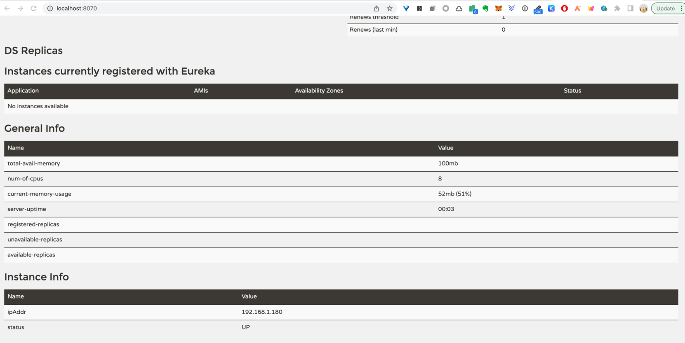
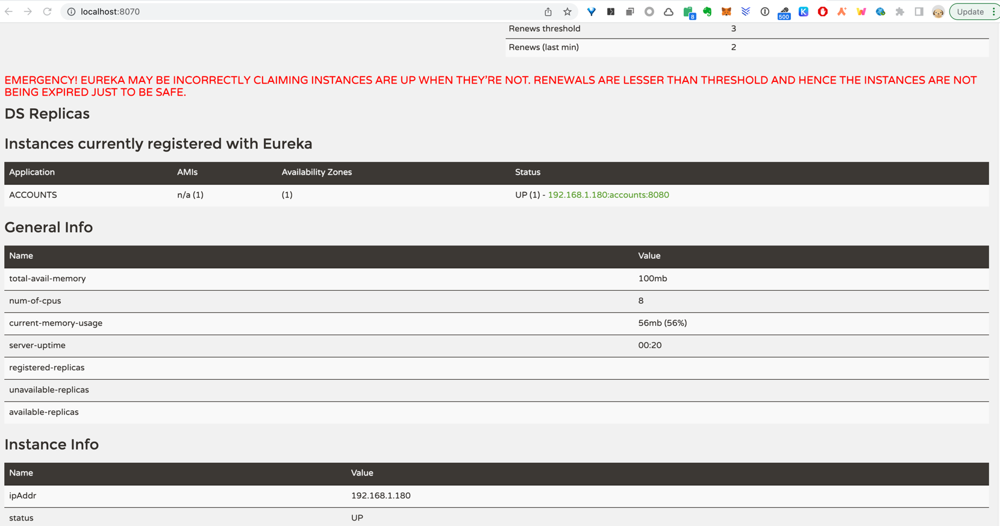

# Java Microservice Demo


## Docker

### Buidling docker

```Bash
docker build . -t frannnnk/accounts
docker build . -t frannnnk/loans
docker build . -t frannnnk/cards
```

### Check Docker Images

```Bash
docker images
```

### Inspect Docker Images

```Bash
docker image inspect <image_id>
```


### Run Docker Container using Image

```Bash
docker run -p 8080:8080 <image_id>
```

### Other useful commands

```Bash
docker logs <container_id>
docker logs -f <container_id>
docker container pause <container_id>
docker container unpause <container_id>
docker stop <container_id>              --> gracefully  
docker kill <container_id>              --> immediately
docker stats                            --> show statistics
docker run -d -p 8080:8080 <image_id>   --> run in detached mode
```

### Push images to dockerhub

```Bash
docker push docker.io/frannnnk/accounts
docker push docker.io/frannnnk/cards
docker push docker.io/frannnnk/loans
```


## Buildpacks

>A buildpack is a program that turns source code into a runnable container image. Usually, buildpacks encapsulate a single language ecosystem toolchain. There are buildpacks for Ruby, Go, NodeJs, Java, Python, and more. These buildpacks can be grouped together into collections called a builder.

Ref: https://technology.doximity.com/articles/buildpacks-vs-dockerfiles

### Add configuration in pom file

```xml
<build>
    <plugins>
        <plugin>
            <groupId>org.springframework.boot</groupId>
            <artifactId>spring-boot-maven-plugin</artifactId>
            <configuration>
                <image>
                    <name>frank/${project.artifactId}</name>
                </image>
            </configuration>
        </plugin>
    </plugins>
</build>
```

Generate docker image using buildpack 
```bash
mvn spring-boot:build-image -Dmaven.test.skip=true
```


## Config Server

Spring Cloud Config is Spring's client/server approach for storing and serving distributed configurations across multiple applications and environments.


Add `dependencyManagement` in pom

```xml
<dependencyManagement>
		<dependencies>
			<dependency>
				<groupId>org.springframework.cloud</groupId>
				<artifactId>spring-cloud-dependencies</artifactId>
				<version>${spring-cloud.version}</version>
				<type>pom</type>
				<scope>import</scope>
			</dependency>
		</dependencies>
	</dependencyManagement>
```

Add `@EnableConfigServer` in Application Class

```Java
@SpringBootApplication
@EnableConfigServer
public class ConfigserverApplication {

	public static void main(String[] args) {
		SpringApplication.run(ConfigserverApplication.class, args);
	}

}
```

Add config in the application.properties

```
spring.application.name=configserver
spring.profiles.active=native
spring.cloud.config.server.native.search-locations=classpath:/config

server.port=8071
```

Then, you can access the config server via http://localhost:8071/accounts/default 


### Config Local Locations

`spring.cloud.config.server.native.search-locations` can be set to:
- file:///C://config
- classpath:/config

### Config Git Locations

We can also load config form git repo, which is also a recommended way. 

Update `application.properties`:

```
spring.application.name=configserver
spring.profiles.active=git
spring.cloud.config.server.git.uri=https://github.com/frannnnk/microservices-config.git
spring.cloud.config.server.git.clone-on-start=true
spring.cloud.config.server.git.default-label=main
server.port=8071
```


## Reading Config form Config Server

Make sure in pom.xml have spring cloud config properly:

```xml
<properties>
	<java.version>11</java.version>
    <spring-cloud.version>2020.0.2</spring-cloud.version>
</properties>

...

<dependencyManagement>
    <dependencies>
        <dependency>
            <groupId>org.springframework.cloud</groupId>
            <artifactId>spring-cloud-dependencies</artifactId>
            <version>${spring-cloud.version}</version>
            <type>pom</type>
            <scope>import</scope>
        </dependency>
    </dependencies>
</dependencyManagement>
```

Add `spring-cloud-starter-config` and `spring-boot-configuration-processor` dependency:

```
<dependency>
    <groupId>org.springframework.cloud</groupId>
    <artifactId>spring-cloud-starter-config</artifactId>
</dependency>
<dependency>
    <groupId>org.springframework.boot</groupId>
    <artifactId>spring-boot-configuration-processor</artifactId>
    <optional>true</optional>
</dependency>
```

Add config server config in `application.properties`

```
# Config Server
spring.application.name=accounts
spring.profiles.active=prod
spring.config.import=optional:configserver:http://localhost:8071
```

Add the config class:

```java
@Configuration
@ConfigurationProperties(prefix = "accounts")
@Getter @Setter @ToString
public class AccountsServiceConfig {
	 private String msg;
	 private String buildVersion;
	 private Map<String, String> mailDetails;
	 private List<String> activeBranches;
}
```

Note the mapping format in the config file and in the java class file.


If all set, you should be able to read config form config server


 

## Refresh Scope

With `@RefreshScope`, SpringBoot can create an API for us to reload the config properties without restarting the application.

First, add the annotation in the application class.

```java
@SpringBootApplication
@RefreshScope
@ComponentScans({ @ComponentScan("com.frank.accounts.controller")})
@EnableJpaRepositories("com.frank.accounts.repository")
@EntityScan("com.frank.accounts.model")
public class AccountsApplication {

	public static void main(String[] args) {
		SpringApplication.run(AccountsApplication.class, args);
	}
}
```

Then, make sure we have `spring-boot-starter-actuator` dependency included.

```xml
<dependency>
    <groupId>org.springframework.boot</groupId>
    <artifactId>spring-boot-starter-actuator</artifactId>
</dependency>
```

in the `application.properties`, also need to config the management endpoint to include the `/actuator/refresh` endpoint.

```
management.endpoints.web.exposure.include=*
```

then we can call the `/actuator/refresh` endpoint with a `POST` request to reload the configs. 


## Config Encryption

Adding a `encrypt.key` setting in `application.properties` will enable the config encryption feature and expose `/encrypt` and `/decrypt` endpoint. 

```
# encryption
encrypt.key=frank
```

In the config source, we can use the encrypted value instead of plain text with a `{cipher}` prefix. The config server will handle the decryption automatically when called by serivce endpoint.

```
accounts.msg={cipher}79373b6e1ca954d5a85d1d36737a5e5085743cdde4c878e33487e0b9fef4d09f
```

## Service Discovery 

Service Discovery is one of the most important topic in microservices. And one essential concept to know is that Service Discovery here is purely for Back-end service only. Do not confuse with UI application which will be handled in API gateway section.


### Create Eureka Server 


Modify the `pom.xml` to exclude some ribbon dependencies. (as the project is already in maintenance mode, we replace it by using `spring cloud load balance` for load balancing ) 

```
<dependency>
    <groupId>org.springframework.cloud</groupId>
    <artifactId>spring-cloud-starter-netflix-eureka-server</artifactId>
    <exclusions>
        <exclusion>
            <groupId>org.springframework.cloud</groupId>
            <artifactId>spring-cloud-starter-ribbon</artifactId>
        </exclusion>
        <exclusion>
            <groupId>com.netflix.ribbon</groupId>
            <artifactId>ribbon-eureka</artifactId>
        </exclusion>
    </exclusions>
</dependency>
```

also add configuration for image generation

```
<build>
    <plugins>
        <plugin>
            <groupId>org.springframework.boot</groupId>
            <artifactId>spring-boot-maven-plugin</artifactId>
            <configuration>
                <image>
                    <name>frannnnk/${project.artifactId}</name>
                </image>
            </configuration>
        </plugin>
    </plugins>
</build>
```

Add `@EnableEurekaServer` annotation to enable eureka server

```java
@SpringBootApplication
@EnableEurekaServer
public class EurekaserverApplication {

	public static void main(String[] args) {
		SpringApplication.run(EurekaserverApplication.class, args);
	}
}
```

add config to `application.properties`

```
spring.application.name=eurekaserver
spring.config.import=optional:configserver:http://localhost:8071/
spring.cloud.loadbalancer.ribbon.enabled=false
```

we also need to create a GitHub config file https://github.com/frannnnk/microservices-config/blob/main/eurekaserver.properties 

```
server.port=8070

eureka.instance.hostname=localhost
eureka.client.registerWithEureka=false    <-- Do not register self as a microservice
eureka.client.fetchRegistry=false
eureka.client.serviceUrl.defaultZone=http://${eureka.instance.hostname}:${server.port}/eureka/
```

Once the application is set and started, we can access the UI in http://localhost:8070/ 



### Register Microservices to Eureka Server

Add dependency in the microservice's pom.xml

```xml
<dependency>
    <groupId>org.springframework.cloud</groupId>
    <artifactId>spring-cloud-starter-netflix-eureka-client</artifactId>
</dependency>
```

add config in the `application.properties`

```properties
# eureka config
eureka.instance.preferIpAddress = true 
eureka.client.registerWithEureka = true
eureka.client.fetchRegistry = true
eureka.client.serviceUrl.defaultZone = http://localhost:8070/eureka/

## Configuring info endpoint for actuator
info.app.name=Accounts Microservice
info.app.description=Eazy Bank Accounts Application
info.app.version=1.0.0

endpoints.shutdown.enabled=true
management.endpoint.shutdown.enabled=true
```

start the application and we should see the application is registered with eureka server



Accessing http://localhost:8070/eureka/apps we can see the application status. or http://localhost:8070/eureka/apps/accounts for individual app status


### Deregister Microservices from Eureka Server


### Invoking another microservice from microservice

Add dependency

```xml
<dependency>
    <groupId>org.springframework.cloud</groupId>
    <artifactId>spring-cloud-starter-openfeign</artifactId>
</dependency>
```

Add `@EnableFeignClients` in application class

```java
@SpringBootApplication
@RefreshScope
@ComponentScans({ @ComponentScan("com.eazybytes.accounts.controller")})
@EnableJpaRepositories("com.eazybytes.accounts.repository")
@EnableFeignClients
@EntityScan("com.eazybytes.accounts.model")
public class AccountsApplication {

	public static void main(String[] args) {
		SpringApplication.run(AccountsApplication.class, args);
	}
}
```

setup FeignClient

```java
package com.eazybytes.accounts.service.client;

import com.eazybytes.accounts.model.Customer;
import com.eazybytes.accounts.model.Loans;
import org.springframework.cloud.openfeign.FeignClient;
import org.springframework.web.bind.annotation.PostMapping;
import org.springframework.web.bind.annotation.RequestBody;

import java.util.List;

@FeignClient("loans")
public interface LoansFeignClient {
    @PostMapping(value = "myLoans", consumes = "application/json")
    List<Loans> getLoansDetails(@RequestBody Customer customer);
}

```


invoke microservices in controller


```java

@Autowired LoansFeignClient loansFeignClient;
@Autowired CardsFeignClient cardsFeignClient;

...


@PostMapping("/myCustomerDetails")
	public CustomerDetails myCustomerDetails(@RequestBody Customer customer) {
		Accounts accounts = accountsRepository.findByCustomerId(customer.getCustomerId());
		List<Loans> loans = loansFeignClient.getLoansDetails(customer);
		List<Cards> cards = cardsFeignClient.getCardsDetails(customer);
		CustomerDetails customerDetails = new CustomerDetails();
		customerDetails.setAccounts(accounts);
		customerDetails.setLoans(loans);
		customerDetails.setCards(cards);
		return customerDetails;
	}
    
    
```


## Resilience 

### Circuit Beaker Pattern

With 

Add dependency

```xml
<dependency>
    <groupId>io.github.resilience4j</groupId>
    <artifactId>resilience4j-spring-boot2</artifactId>
</dependency>
<dependency>
    <groupId>io.github.resilience4j</groupId>
    <artifactId>resilience4j-circuitbreaker</artifactId>
</dependency>
<dependency>
    <groupId>io.github.resilience4j</groupId>
    <artifactId>resilience4j-timelimiter</artifactId>
</dependency>
<dependency>
    <groupId>org.springframework.boot</groupId>
    <artifactId>spring-boot-starter-aop</artifactId>
</dependency>
```

Add annotation to API:

```java
@PostMapping("/myCustomerDetails")
@CircuitBreaker(name="detailsForCustomerSupportApp")
public CustomerDetails myCustomerDetails(@RequestBody Customer customer) {
    Accounts accounts = accountsRepository.findByCustomerId(customer.getCustomerId());
    List<Loans> loans = loansFeignClient.getLoansDetails(customer);
    List<Cards> cards = cardsFeignClient.getCardsDetails(customer);
    CustomerDetails customerDetails = new CustomerDetails();
    customerDetails.setAccounts(accounts);
    customerDetails.setLoans(loans);
    customerDetails.setCards(cards);
    return customerDetails;
}
```

Add config in `application.properties`

```properties
## resilience4j
resilience4j.circuitbreaker.configs.default.registerHealthIndicator= true
resilience4j.circuitbreaker.instances.detailsForCustomerSupportApp.minimumNumberOfCalls= 5
resilience4j.circuitbreaker.instances.detailsForCustomerSupportApp.failureRateThreshold= 50
resilience4j.circuitbreaker.instances.detailsForCustomerSupportApp.waitDurationInOpenState= 30000
resilience4j.circuitbreaker.instances.detailsForCustomerSupportApp.permittedNumberOfCallsInHalfOpenState=2
```

#### Circuit Beaker Fallback

Adding a function in the same class can privide a fallback function for the Circuit Beaker. Specify in the `fallbackMethod` and the method needs to have a `Throwable throwable` input parameter.

```java
@PostMapping("/myCustomerDetails")
@CircuitBreaker(name="detailsForCustomerSupportApp", fallbackMethod = "myCustomerDetailsFallBack")
public CustomerDetails myCustomerDetails(@RequestBody Customer customer) {
    Accounts accounts = accountsRepository.findByCustomerId(customer.getCustomerId());
    List<Loans> loans = loansFeignClient.getLoansDetails(customer);
    List<Cards> cards = cardsFeignClient.getCardsDetails(customer);
    CustomerDetails customerDetails = new CustomerDetails();
    customerDetails.setAccounts(accounts);
    customerDetails.setLoans(loans);
    customerDetails.setCards(cards);
    return customerDetails;
}

/**
 * - Accept the same object with the original API
 * - Accept a throwable is required
 *
 */
private CustomerDetails myCustomerDetailsFallBack(Customer customer, Throwable throwable) {
    Accounts accounts = accountsRepository.findByCustomerId(customer.getCustomerId());
    List<Loans> loans = loansFeignClient.getLoansDetails(customer);
    CustomerDetails customerDetails = new CustomerDetails();
    customerDetails.setAccounts(accounts);
    customerDetails.setLoans(loans);
    return customerDetails;
}

```


### Retry Pattern


Add config in `application.properties`

```properties
resilience4j.retry.configs.default.registerHealthIndicator= true
resilience4j.retry.instances.retryForCustomerDetails.maxAttempts=3
resilience4j.retry.instances.retryForCustomerDetails.waitDuration=2000
```

Note that the name in the config of `application.properties`  must match the one set in the `@Retry(name="retryForCustomerDetails")`.

```
@PostMapping("/myCustomerDetailsRetry")
@Retry(name="retryForCustomerDetails")
public CustomerDetails myCustomerDetailsRetry(@RequestBody Customer customer) {
    Accounts accounts = accountsRepository.findByCustomerId(customer.getCustomerId());
    List<Loans> loans = loansFeignClient.getLoansDetails(customer);
    List<Cards> cards = cardsFeignClient.getCardsDetails(customer);
    CustomerDetails customerDetails = new CustomerDetails();
    customerDetails.setAccounts(accounts);
    customerDetails.setLoans(loans);
    customerDetails.setCards(cards);
    return customerDetails;
}
```

### Rate Limit Pattern


Add config in `application.properties`

```properties
resilience4j.ratelimiter.configs.default.registerHealthIndicator= true
resilience4j.ratelimiter.instances.rateLimitForCustomerDetails.timeoutDuration=5000
resilience4j.ratelimiter.instances.rateLimitForCustomerDetails.limitRefreshPeriod=5000
resilience4j.ratelimiter.instances.rateLimitForCustomerDetails.limitForPeriod=1
```

Note that the name in the config of `application.properties`  must match the one set in the `@Retry(name="retryForCustomerDetails")`.

```
@PostMapping("/myCustomerDetailsRateLimit")
@RateLimiter(name="rateLimitForCustomerDetails" , fallbackMethod = "myCustomerDetailsFallBack2")
public CustomerDetails myCustomerDetailsRateLimit(@RequestBody Customer customer) {
    Accounts accounts = accountsRepository.findByCustomerId(customer.getCustomerId());
    List<Loans> loans = loansFeignClient.getLoansDetails(customer);
    List<Cards> cards = cardsFeignClient.getCardsDetails(customer);
    CustomerDetails customerDetails = new CustomerDetails();
    customerDetails.setAccounts(accounts);
    customerDetails.setLoans(loans);
    customerDetails.setCards(cards);
    return customerDetails;
}
```


### Bulkhead Pattern


## Spring Cloud Gateway


### Dependencies


```xml
<dependency>
    <groupId>org.springframework.boot</groupId>
    <artifactId>spring-boot-starter-actuator</artifactId>
</dependency>
<dependency>
    <groupId>org.springframework.cloud</groupId>
    <artifactId>spring-cloud-starter-config</artifactId>
</dependency>
<dependency>
    <groupId>org.springframework.cloud</groupId>
    <artifactId>spring-cloud-starter-gateway</artifactId>
</dependency>
<dependency>
    <groupId>org.springframework.cloud</groupId>
    <artifactId>spring-cloud-starter-netflix-eureka-client</artifactId>
</dependency>
<dependency>
    <groupId>org.springframework.boot</groupId>
    <artifactId>spring-boot-devtools</artifactId>
    <scope>runtime</scope>
    <optional>true</optional>
</dependency>
<dependency>
    <groupId>org.springframework.boot</groupId>
    <artifactId>spring-boot-starter-test</artifactId>
    <scope>test</scope>
</dependency>

...

<dependencyManagement>
<dependencies>
    <dependency>
        <groupId>org.springframework.cloud</groupId>
        <artifactId>spring-cloud-dependencies</artifactId>
        <version>${spring-cloud.version}</version>
        <type>pom</type>
        <scope>import</scope>
    </dependency>
</dependencies>
</dependencyManagement>

```

```java
@SpringBootApplication
@EnableEurekaClient
public class GatewayserverApplication {
    ...
}
```

```properties
spring.application.name=gatewayserver
spring.config.import=optional:configserver:http://localhost:8071/
management.endpoints.web.exposure.include=*

## Configuring info endpoint
info.app.name=Gateway Server Microservice
info.app.description=Eazy Bank Gateway Server Application
info.app.version=1.0.0

spring.cloud.gateway.discovery.locator.enabled=true   --> With this config, the gateway will fetch the detail from the eureka server
spring.cloud.gateway.discovery.locator.lowerCaseServiceId=true

logging.level.com.eaztbytes.gatewayserver: DEBUG
```

Route rewrite 

```java
@Bean
public RouteLocator myRoutes(RouteLocatorBuilder builder) {
    return builder.routes()
        .route(p -> p
            .path("/frannnnk/accounts/**")
            .filters(f -> f.rewritePath("/frannnnk/accounts/(?<segment>.*)","/${segment}")
                            .addResponseHeader("X-Response-Time",new Date().toString()))
            .uri("lb://ACCOUNTS")).
        route(p -> p
                .path("/frannnnk/loans/**")
                .filters(f -> f.rewritePath("/frannnnk/loans/(?<segment>.*)","/${segment}")
                        .addResponseHeader("X-Response-Time",new Date().toString()))
                .uri("lb://LOANS")).
        route(p -> p
                .path("/frannnnk/cards/**")
                .filters(f -> f.rewritePath("/frannnnk/cards/(?<segment>.*)","/${segment}")
                        .addResponseHeader("X-Response-Time",new Date().toString()))
                .uri("lb://CARDS")).build();
}
```


